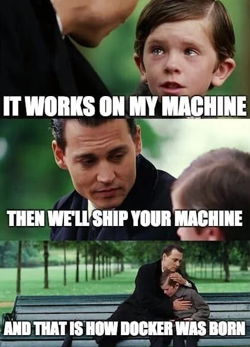

# OAI-lab2

## 94879 Fundamentals of Operationalizing AI Lab 2 | Introduction to Docker and Docker Hub


## Introduction to Docker and Why Docker



Docker is a powerful platform for developing, shipping, and running applications. By using Docker, you can quickly deploy and scale applications into any environment and be assured your code will run.

Docker simplifies the management of application processes and environments, ensuring that your application works seamlessly in development, staging, and production. This lab introduces Docker and Docker Hub, giving you the practical experience to deploy a Flask-based machine learning regression app using Docker containers.

## Docker Install and Set up

Before you begin, ensure that Docker is installed and set up on your system. Please refer to the [official Docker documentation](https://docs.docker.com/get-docker/) for installation instructions for your specific operating system.

## Build a Flask-based ML Regression App

First, clone the repository or download the two Python files (`app.py` and `model.py`), the `Dockerfile`, and `requirements.txt` into a folder on your machine.

```
git clone https://github.com/jyunyuk/OAI-lab2.git
cd OAI-lab2
```

## Step by Step: Dockerize It
### Step 0: Create your `Dockerfile` and `requirements.txt`
### Step 1: Build the Docker Image:
```
docker build -t myapp .
```

### Step 2: Run the Flask App in a Docker Container:
After the image is built, run your app inside a Docker container using the following command. This command maps your container's port 80 to port 80 on your host, making the app accessible on port 80.
```
docker run -p 80:80 myapp
```

### Step 3: Visit Your App:
Open your browser and navigate to http://127.0.0.1:80 to see the Flask app running in a Docker container.

## Deploy Your App on Docker Hub
### Step 1: Tag Your Docker Image
Before you push your Docker image to Docker Hub, you need to tag it with your Docker Hub username and repository name. The general format for the tag is `username/repository:tag`. If you don't specify a tag, latest is used by default.

For example, if your Docker Hub username is username and you want your repository to be named myapp, you would tag your Docker image like this:
```
docker tag myapp username/myapp:latest
```

### Step 2: Push the Docker Image to Docker Hub
Now, push the tagged image to Docker Hub using the docker push command:
```
docker push username/myapp:latest
```
Replace  `username/myapp:latest` with the tag you used in the previous step. This will upload your image to Docker Hub.


### Step 3: Verify the Image is on Docker Hub
- Go to [Docker Hub](https://hub.docker.com/).
- Log in to your account.
- Navigate to your repositories to see if myapp is listed there.
  
  
  
### Step 4: Pull the Docker Image from Docker Hub
On any system with Docker installed, you can now test pulling down the image from Docker Hub:
```
docker pull username/myapp:latest
```

### Step 5: Run the Container from the Pulled Image
After pulling the image, you can run a container from it to make sure it works:
```
docker run -p 80:80 username/myapp:latest
```
This will start a container from your Docker image and map port 80 from the container to port 80 on the host machine.


### Step 6: Test the Application
Open a web browser and navigate to http://127.0.0.1:80 to see if your application is running as expected.


## Terminologies
- **Images:** In our Flask application context, an image is the static snapshot of our app's code, libraries, and dependencies. It acts as a template to create containers. When we built our app's image with docker build, we effectively created this blueprint.

- **Containers:** These are the running instances of Docker images. When we executed docker run with our Flask app's image, we created a container where our app is live and can respond to requests. You can see all running containers with docker ps.

- **Docker Daemon:** This is a persistent background service that manages and orchestrates Docker containers on the host machine. It was responsible for handling the image creation and container management when we used commands like docker build and docker run for our Flask application.

- **Docker Client:** It's the tool, typically the command line interface (CLI), that we used to give instructions to the Docker Daemon, such as building an image (docker build) or starting a container (docker run). It communicates with the Docker Daemon to execute these commands.

- **Docker Hub:** A cloud-based registry service to share and store Docker images. When we pushed our Flask app's image using docker push, it was uploaded to Docker Hub, making it available for others to download and use with docker pull.
